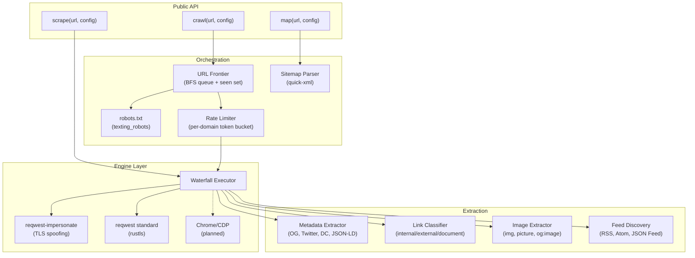
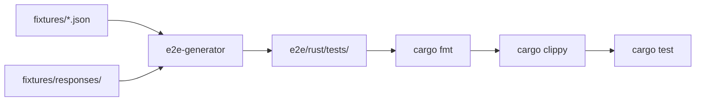

# kreuzcrawl

A Rust crawling engine for turning websites into structured data.

**Status**: Under development — E2E test infrastructure complete, engine implementation in progress.

## Features (planned)

- **Scrape** — Fetch a single URL with exhaustive metadata extraction
- **Crawl** — Follow links with BFS traversal, rate limiting, robots.txt compliance
- **Map** — Discover all URLs on a site via sitemap + link crawling
- Anti-bot bypass via TLS fingerprint spoofing (reqwest-impersonate)
- Exhaustive metadata: Open Graph, Twitter Card, Dublin Core, JSON-LD, feeds, images
- Future integrations: html-to-markdown, kreuzberg document extraction, tree-sitter code parsing

## Architecture



## Repository Structure

```
kreuzcrawl/
├── crates/
│   └── kreuzcrawl/              # Core library crate
│       └── src/lib.rs
├── tools/
│   └── e2e-generator/           # Fixture-driven test generator
│       └── src/
│           ├── main.rs           # CLI (generate, list)
│           ├── fixtures.rs       # Fixture schema + loader
│           └── rust.rs           # Rust test code generator
├── fixtures/                    # 77 E2E test fixtures
│   ├── schema.json              # JSON Schema (draft-07)
│   ├── scrape/     (10)         # Single-page scraping
│   ├── metadata/   (5)          # Metadata extraction
│   ├── links/      (4)          # Link classification
│   ├── crawl/      (11)         # Multi-page BFS crawling
│   ├── robots/     (9)          # robots.txt compliance
│   ├── sitemap/    (7)          # Sitemap parsing
│   ├── error/      (10)         # Error handling + retry
│   ├── redirect/   (6)          # HTTP redirect handling
│   ├── content/    (6)          # Content type handling
│   ├── cookies/    (3)          # Cookie management
│   ├── auth/       (3)          # Authentication
│   ├── map/        (3)          # URL discovery
│   └── responses/               # Mock response bodies
│       ├── html/   (17 files)
│       ├── robots/ (9 files)
│       ├── xml/    (4 files)
│       ├── error/  (2 files)
│       └── pdf/    (1 file)
├── e2e/                         # Generated test suites (gitignored)
│   └── rust/
│       ├── Cargo.toml
│       ├── src/helpers.rs
│       └── tests/ (12 test files)
├── docs/adr/                    # Architecture Decision Records
│   ├── 001-engine-architecture.md
│   ├── 002-workspace-structure.md
│   ├── 003-crawl-orchestration.md
│   ├── 004-metadata-extraction.md
│   ├── 005-future-integration-points.md
│   ├── 006-e2e-testing-strategy.md
│   └── 007-behavioral-fixture-derivation.md
├── .github/workflows/
│   ├── ci-rust.yaml             # Build + test (Linux, macOS)
│   └── ci-validate.yaml         # Lint + format + hooks
├── Cargo.toml                   # Workspace root
├── Taskfile.yml                 # Task automation
└── deny.toml                    # Cargo security audit
```

## E2E Testing Pipeline

Tests are generated from JSON fixtures using wiremock-based mock HTTP servers. No real network calls.



### Fixture Categories

| Category | Count | API | Tests |
|----------|-------|-----|-------|
| scrape | 10 | `scrape()` | HTML parsing, metadata, feeds, malformed HTML |
| metadata | 5 | `scrape()` | OG, Twitter Card, Dublin Core, article tags |
| links | 4 | `scrape()` | Internal/external classification, document types |
| crawl | 11 | `crawl()` | BFS depth, page limits, subdomains, URL filtering |
| robots | 9 | `scrape()` | Allow/disallow, wildcards, user-agent rules |
| sitemap | 7 | `map()` | XML parsing, index files, gzip, lastmod |
| error | 10 | `scrape()` | HTTP errors, timeouts, retry, SSL, DNS |
| redirect | 6 | `crawl()` | 301/302 chains, loops, meta-refresh |
| content | 6 | `scrape()` | Charset, compression, body size, binary skip |
| cookies | 3 | `crawl()` | Persistence, per-domain, Set-Cookie |
| auth | 3 | `scrape()` | Basic, bearer, custom header |
| map | 3 | `map()` | URL discovery, subdomain inclusion, filtering |

### Commands

```bash
task e2e:generate    # Generate tests + format + lint
task e2e:test        # Generate + run tests
task e2e:list        # List all 77 fixtures
task e2e:verify      # Full pipeline + git diff check
task e2e:verify:ci   # CI: generate + fmt --check + clippy + diff
```

## Development

```bash
# Setup
task setup

# Build
task build

# Test
task test

# Lint (pre-commit hooks)
task lint

# Format
task format
```

## Architecture Decision Records

| ADR | Decision |
|-----|----------|
| [001](docs/adr/001-engine-architecture.md) | Waterfall fetch: reqwest-impersonate (TLS spoofing) with reqwest fallback |
| [002](docs/adr/002-workspace-structure.md) | crates/ + tools/ workspace layout with separate E2E generator |
| [003](docs/adr/003-crawl-orchestration.md) | Async BFS with URL frontier, per-domain rate limiting, robots.txt |
| [004](docs/adr/004-metadata-extraction.md) | Exhaustive HTML metadata model (OG, Twitter, DC, JSON-LD, feeds) |
| [005](docs/adr/005-future-integration-points.md) | Feature-gated integrations: html-to-markdown, kreuzberg, tree-sitter |
| [006](docs/adr/006-e2e-testing-strategy.md) | Fixture-driven E2E with wiremock, 12-category assertion framework |
| [007](docs/adr/007-behavioral-fixture-derivation.md) | 77 fixtures derived from firecrawl, spider.rs, scrapy, colly |

## License

MIT License — see [LICENSE](LICENSE).
