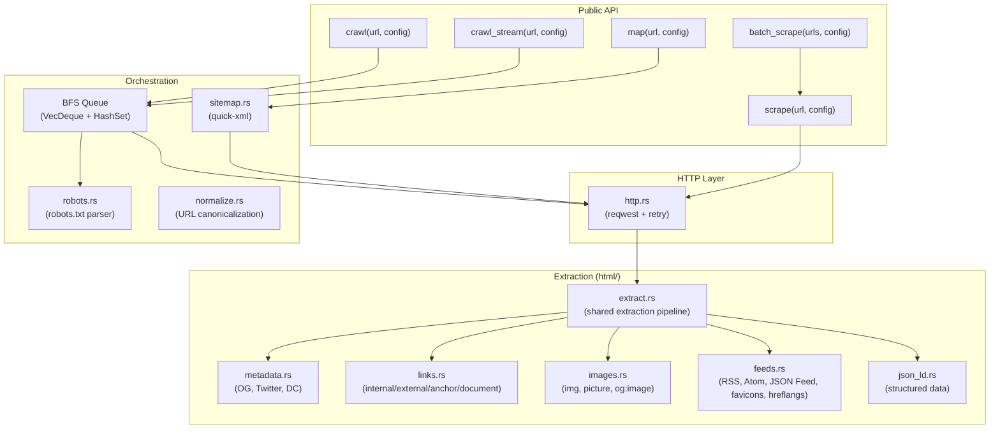
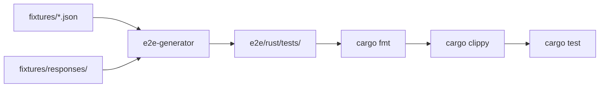

# kreuzcrawl

A Rust crawling engine for turning websites into structured data.

## Features

- **Scrape** — Fetch a single URL with exhaustive metadata extraction
- **Crawl** — Follow links with BFS traversal, robots.txt compliance, depth/page limits
- **Map** — Discover all URLs on a site via sitemap + link crawling
- **Stream** — Crawl with real-time event streaming via `crawl_stream()`
- **Batch** — Scrape multiple URLs concurrently via `batch_scrape()`
- **Asset downloading** — Optionally download CSS, JS, and image assets with deduplication
- Exhaustive metadata: Open Graph, Twitter Card, Dublin Core, JSON-LD, feeds, images, hreflang, favicons
- robots.txt compliance with RFC 9309 user-agent prefix matching
- Redirect chain following (HTTP 3xx, Refresh header, meta refresh)
- Cookie tracking and deduplication
- Authentication: Basic, Bearer, custom header
- Charset detection, body size limits, binary/PDF content skipping
- Retry with configurable status codes and count

## Architecture



## Repository Structure

```
kreuzcrawl/
├── crates/
│   └── kreuzcrawl/              # Core library crate (3484 lines)
│       └── src/
│           ├── lib.rs            # Public API exports
│           ├── scrape.rs         # Single-page scrape
│           ├── crawl.rs          # Multi-page BFS crawl
│           ├── map.rs            # URL discovery via sitemap + crawl
│           ├── stream.rs         # Streaming crawl events
│           ├── batch.rs          # Concurrent batch scraping
│           ├── assets.rs         # Asset discovery and downloading
│           ├── http.rs           # HTTP client, retry, cookie extraction
│           ├── robots.rs         # robots.txt parsing (RFC 9309)
│           ├── sitemap.rs        # Sitemap XML/index/gzip parsing
│           ├── normalize.rs      # URL normalization and deduplication
│           ├── error.rs          # Error types
│           ├── types.rs          # All public types (601 lines)
│           └── html/             # HTML extraction submodules
│               ├── mod.rs        # Re-exports
│               ├── extract.rs    # Shared extraction pipeline
│               ├── metadata.rs   # Meta tags, OG, Twitter, DC, article
│               ├── links.rs      # Link extraction and classification
│               ├── images.rs     # Image extraction from multiple sources
│               ├── feeds.rs      # Feeds, favicons, hreflangs, headings
│               ├── json_ld.rs    # JSON-LD structured data
│               ├── content.rs    # Main content extraction, tag removal
│               ├── charset.rs    # Charset detection
│               ├── detection.rs  # Content type detection (HTML, PDF, binary)
│               └── selectors.rs  # Lazy CSS selectors and regex patterns
├── tools/
│   └── e2e-generator/           # Fixture-driven test generator
│       └── src/
│           ├── main.rs           # CLI (generate, list)
│           ├── fixtures.rs       # Fixture schema + loader
│           └── rust.rs           # Rust test code generator
├── fixtures/                    # 132 E2E test fixtures
│   ├── schema.json              # JSON Schema (draft-07)
│   ├── scrape/     (15)         # Single-page scraping
│   ├── metadata/   (8)          # Metadata extraction
│   ├── links/      (9)          # Link classification
│   ├── crawl/      (18)         # Multi-page BFS crawling
│   ├── robots/     (14)         # robots.txt compliance
│   ├── sitemap/    (8)          # Sitemap parsing
│   ├── error/      (17)         # Error handling + retry
│   ├── redirect/   (12)         # HTTP redirect handling
│   ├── content/    (11)         # Content type handling
│   ├── cookies/    (3)          # Cookie management
│   ├── auth/       (3)          # Authentication
│   ├── map/        (6)          # URL discovery
│   ├── batch/      (3)          # Batch scraping
│   ├── stream/     (1)          # Streaming events
│   ├── encoding/   (4)          # Character encoding
│   └── responses/               # Mock response bodies (56 files)
│       ├── html/   (33 files)
│       ├── robots/ (11 files)
│       ├── xml/    (6 files)
│       ├── assets/ (3 files)
│       ├── error/  (2 files)
│       └── pdf/    (1 file)
├── e2e/                         # Generated test suites (gitignored)
│   └── rust/
│       ├── Cargo.toml
│       ├── src/helpers.rs       # Mock server helpers
│       └── tests/ (17 test files)
├── docs/adr/                    # Architecture Decision Records
├── .github/workflows/
│   ├── ci-rust.yaml             # Build + test (Linux, macOS)
│   └── ci-validate.yaml         # Lint + format + hooks
├── Cargo.toml                   # Workspace root
├── Taskfile.yml                 # Task automation
└── deny.toml                    # Cargo security audit
```

## E2E Testing Pipeline

Tests are generated from JSON fixtures using wiremock-based mock HTTP servers. No real network calls.



### Fixture Categories

| Category | Count | API | Tests |
|----------|-------|-----|-------|
| scrape | 15 | `scrape()` | HTML parsing, metadata, feeds, assets, malformed HTML |
| metadata | 8 | `scrape()` | OG, Twitter Card, Dublin Core, article, hreflang, favicons, headings, word count |
| links | 9 | `scrape()` | Internal/external classification, document types, nofollow |
| crawl | 18 | `crawl()` | BFS depth, page limits, subdomains, URL filtering, deduplication |
| robots | 14 | `scrape()` | Allow/disallow, wildcards, user-agent prefix matching (RFC 9309) |
| sitemap | 8 | `map()` | XML parsing, index files, gzip, lastmod |
| error | 17 | `scrape()` | HTTP errors, timeouts, retry, SSL, DNS, WAF detection |
| redirect | 12 | `crawl()` | 301/302 chains, loops, meta-refresh, Refresh header |
| content | 11 | `scrape()` | Charset, body size, binary skip, PDF detection, main content |
| cookies | 3 | `crawl()` | Persistence, Set-Cookie, deduplication by (name, domain, path) |
| auth | 3 | `scrape()` | Basic, bearer, custom header |
| map | 6 | `map()` | URL discovery, subdomain inclusion, search filtering |
| batch | 3 | `batch_scrape()` | Concurrent scraping, partial failures |
| stream | 1 | `crawl_stream()` | Event streaming (Page, Error, Complete) |
| encoding | 4 | `scrape()` | UTF-8, ISO-8859-1, charset detection |

### Commands

```bash
task e2e:generate    # Generate tests + format + lint
task e2e:test        # Generate + run tests
task e2e:list        # List all 132 fixtures
task e2e:verify      # Full pipeline + git diff check
task e2e:verify:ci   # CI: generate + fmt --check + clippy + diff
```

## Development

```bash
# Setup
task setup

# Build
task build

# Test
task test

# Lint (pre-commit hooks)
task lint

# Format
task format
```

## Architecture Decision Records

| ADR | Decision |
|-----|----------|
| [001](docs/adr/001-engine-architecture.md) | HTTP fetching with reqwest, retry logic, cookie support |
| [002](docs/adr/002-workspace-structure.md) | crates/ + tools/ workspace layout with separate E2E generator |
| [003](docs/adr/003-crawl-orchestration.md) | Async BFS with VecDeque + HashSet, robots.txt, URL normalization |
| [004](docs/adr/004-metadata-extraction.md) | Exhaustive HTML metadata model via scraper (html5ever) |
| [005](docs/adr/005-future-integration-points.md) | Feature-gated integrations: html-to-markdown, kreuzberg, tree-sitter |
| [006](docs/adr/006-e2e-testing-strategy.md) | Fixture-driven E2E with wiremock, 30 assertion types across 15 categories |
| [007](docs/adr/007-behavioral-fixture-derivation.md) | 132 fixtures derived from firecrawl, spider.rs, scrapy, colly |

## License

MIT License — see [LICENSE](LICENSE).
