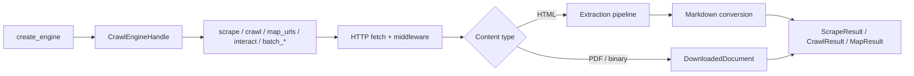

# Architecture

Crawlberg is a Rust core crate (`crawlberg`) with a small public surface, surrounded by polyglot bindings that all wrap the same core. The runtime is Tokio; HTTP fetching uses `reqwest`; browser-backed rendering and interaction can use either the chromiumoxide CDP backend or the in-process native backend.

## Public surface

The crate root exports seven free functions over an opaque handle, plus serialisable configuration and result types:

| Symbol                                                                                | Purpose                                                      |
| ------------------------------------------------------------------------------------- | ------------------------------------------------------------ |
| `create_engine(config: Option<CrawlConfig>) -> Result<CrawlEngineHandle, CrawlError>` | Build an engine from a validated `CrawlConfig`.              |
| `scrape(&engine, url) -> Result<ScrapeResult, _>`                                     | Fetch and extract a single page.                             |
| `crawl(&engine, url) -> Result<CrawlResult, _>`                                       | Follow links from a seed up to `max_depth` / `max_pages`.    |
| `map_urls(&engine, url) -> Result<MapResult, _>`                                      | Discover URLs via sitemaps and link extraction.              |
| `interact(&engine, url, actions) -> Result<InteractionResult, _>`                     | Navigate once and run ordered page actions.                  |
| `batch_scrape(&engine, urls) -> Result<BatchScrapeResults, _>`                        | Scrape many URLs concurrently and return aggregate counts.    |
| `batch_crawl(&engine, urls) -> Result<BatchCrawlResults, _>`                          | Crawl many seeds concurrently and return aggregate counts.    |
| `serve_api(...)` (feature `api`) / `start_mcp_server(...)` (feature `mcp`)            | Long-running REST and MCP servers backed by the same engine. |

All other items in the source tree are internal — the public crate surface is intentionally narrow.

## Data flow

The middleware stack between the engine and the network applies per-domain rate limiting, conditional caching, and User-Agent rotation, plus OpenTelemetry wiring when `telemetry-init` is enabled. WAF responses can trigger an automatic browser fallback when `BrowserMode::Auto` is set. `interact()` bypasses the crawl/extraction pipeline and keeps one browser page open while it executes `PageAction` values such as click, type, wait, screenshot, JavaScript evaluation, and scrape. Chromiumoxide screenshots are compositor captures; native screenshots are deterministic PNG snapshots derived from the post-action HTML and are intended for inspection, not pixel-perfect Chrome parity. The extraction pipeline is described in detail in [Content Extraction](content-extraction.md).

## Bindings

Every binding consumes the same Rust core via FFI. The per-binding glue is generated by [alef](https://github.com/xberg-io/alef) from the core types and a binding manifest (`alef.toml`); generated code lives under `packages/<lang>/` and `crates/crawlberg-<binding>/`. Binding-level differences (async runtimes, naming conventions, type marshalling) are handled by the generator — the core itself stays language-agnostic.

| Binding crate                | Distribution                                                | Mechanism                 |
| ---------------------------- | ----------------------------------------------------------- | ------------------------- |
| `crates/crawlberg-py`       | PyPI `crawlberg`                                           | PyO3 + maturin            |
| `crates/crawlberg-node`     | npm `@kreuzberg/crawlberg`                                 | NAPI-RS                   |
| `crates/crawlberg-php`      | Composer `xberg-io/crawlberg`                         | ext-php-rs                |
| `crates/crawlberg-wasm`     | npm `@kreuzberg/crawlberg-wasm`                            | wasm-bindgen              |
| `crates/crawlberg-ffi`      | Shared library + cbindgen header                            | C FFI                     |
| `packages/ruby/ext/...`      | RubyGems `crawlberg`                                       | Magnus + rb-sys           |
| `packages/elixir/native/...` | Hex `crawlberg`                                            | Rustler NIF               |
| `packages/go`                | Go module `github.com/xberg-io/crawlberg/packages/go` | cgo over C FFI            |
| `packages/java`              | Maven Central `dev.kreuzberg.crawlberg:crawlberg`         | Java 25 Panama FFM        |
| `packages/kotlin-android`    | Maven Central `dev.kreuzberg.crawlberg:crawlberg-android` | Android AAR with JNI .sos |
| `packages/csharp`            | NuGet `Crawlberg`                                          | .NET 10 P/Invoke          |
| `packages/dart`              | pub.dev `crawlberg`                                        | Dart FFI                  |
| `packages/swift`             | Swift Package Manager                                       | Swift over C FFI          |
| `packages/zig`               | `zig fetch --save`                                          | Zig over C FFI            |

## Feature gates

Cargo features keep the default build minimal. The default feature set is `native-runtime`; WebAssembly builds disable native-only dependencies by target configuration. The user-facing features are:

| Feature              | Capability                                                                                  |
| -------------------- | ------------------------------------------------------------------------------------------- |
| `native-runtime`     | Native OS runtime marker; enabled by default outside wasm32.                                |
| `browser`            | Chromiumoxide CDP backend for JS-heavy or WAF-protected pages.                              |
| `browser-chromiumoxide` | Direct Chromiumoxide backend feature used by `browser`.                                  |
| `browser-native`     | In-process native browser backend for rendering, extras, and network-event capture.         |
| `interact`           | Compatibility alias for browser-backed page interaction. The public API is always compiled. |
| `ai`                 | LLM extraction via liter-llm.                                                               |
| `telemetry-init`     | One-call OTLP tracer/meter/provider setup and W3C propagation.                              |
| `api`                | `serve_api(...)` - Firecrawl v1-compatible REST server.                                     |
| `mcp`                | `start_mcp_server(...)` - Model Context Protocol server for AI-agent integration.           |
| `mcp-http`           | MCP over HTTP transport (implies `mcp` + `api`).                                            |
| `warc`               | WARC 1.1 output via `CrawlConfig::warc_output`.                                             |
| `full`               | Convenience feature for browser, native browser, AI, telemetry init, API, MCP, and WARC.    |
