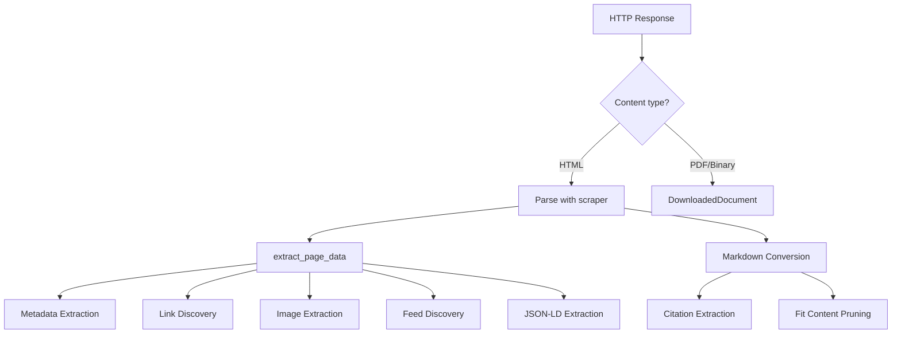

# Content Extraction

Kreuzcrawl's extraction pipeline transforms raw HTTP responses into richly structured data. Every HTML page passes through metadata extraction, link discovery, feed detection, JSON-LD parsing, and Markdown conversion.

## Extraction Pipeline



All HTML parsing is performed via `scraper::Html::parse_document`, which runs inside `tokio::task::spawn_blocking` because the scraper `Html` type is `!Send`.

## Metadata Extraction

The `extract_metadata` function pulls structured metadata from `<meta>` tags, `<title>`, `<link rel="canonical">`, and HTML element attributes. The result is a `PageMetadata` struct with 40+ optional fields spanning multiple standards:

### Standard HTML Meta

| Field | Source |
|-------|--------|
| `title` | `<title>` element |
| `description` | `<meta name="description">` |
| `canonical_url` | `<link rel="canonical">` |
| `keywords` | `<meta name="keywords">` |
| `author` | `<meta name="author">` |
| `viewport` | `<meta name="viewport">` |
| `theme_color` | `<meta name="theme-color">` |
| `generator` | `<meta name="generator">` |
| `robots` | `<meta name="robots">` |
| `html_lang` | `<html lang="...">` attribute |
| `html_dir` | `<html dir="...">` attribute |

### Open Graph

`og_title`, `og_type`, `og_image`, `og_description`, `og_url`, `og_site_name`, `og_locale`, `og_video`, `og_audio`, `og_locale_alternates`

### Twitter Cards

`twitter_card`, `twitter_title`, `twitter_description`, `twitter_image`, `twitter_site`, `twitter_creator`

### Dublin Core

`dc_title`, `dc_creator`, `dc_subject`, `dc_description`, `dc_publisher`, `dc_date`, `dc_type`, `dc_format`, `dc_identifier`, `dc_language`, `dc_rights`

### Article Metadata

The `ArticleMetadata` struct captures Open Graph article tags:

- `published_time`, `modified_time`, `author`, `section`, `tags`

### Extended Metadata

When `include_extended` is true (used in scrape mode), additional fields are populated:

- `hreflangs: Vec<HreflangEntry>` -- alternate language versions from `<link rel="alternate" hreflang="...">`.
- `favicons: Vec<FaviconInfo>` -- icon links with URL, rel, sizes, and MIME type.
- `headings: Vec<HeadingInfo>` -- all heading elements (h1-h6) with level and text.
- `word_count` -- computed word count of the visible text content.

### Regex Fallback

For malformed HTML where DOM parsing misses meta tags, a regex-based fallback extracts `description`, `og:title`, `og:description`, `twitter:title`, and `twitter:description` from the raw body.

## Markdown Conversion

Markdown conversion is always active and delegates to `html-to-markdown-rs` inside a blocking task:

```rust
pub(crate) async fn convert_to_markdown(html: &str) -> Option<MarkdownResult>
```

The `MarkdownResult` struct contains:

| Field | Type | Description |
|-------|------|-------------|
| `content` | `String` | The converted Markdown text |
| `document_structure` | `Option<Value>` | Serialized document structure (headings, sections) |
| `tables` | `Vec<Value>` | Extracted table data as structured JSON |
| `warnings` | `Vec<String>` | Conversion warnings (e.g., unsupported elements) |
| `citations` | `Option<CitationResult>` | Extracted references and bibliography |
| `fit_content` | `Option<String>` | Pruned markdown for LLM consumption |

### Citations

The `generate_citations` function scans the Markdown output for inline links and produces a `CitationResult` with deduplicated references suitable for academic-style citation.

### Fit Content

The `generate_fit_markdown` function produces a pruned version of the Markdown that strips navigation boilerplate, redundant whitespace, and low-signal content. This is optimized for feeding into LLMs where token budget matters.

## Feed Discovery

The extraction pipeline discovers syndication feeds from `<link rel="alternate">` elements:

| Feed Type | MIME Type |
|-----------|-----------|
| `FeedType::Rss` | `application/rss+xml` |
| `FeedType::Atom` | `application/atom+xml` |
| `FeedType::JsonFeed` | `application/json` or `application/feed+json` |

Each `FeedInfo` includes the feed URL, optional title, and feed type.

## JSON-LD Extraction

`<script type="application/ld+json">` blocks are parsed and returned as `Vec<JsonLdEntry>`, preserving the structured data exactly as authored by the page.

## Link Discovery

The `extract_links` function discovers all `<a href="...">` links on a page, returning `Vec<LinkInfo>` with:

- Resolved absolute URL (relative URLs are resolved against the page's base URL)
- Link text content
- `rel` attribute value (e.g., `nofollow`)

## Image Extraction

Images are extracted from `` elements as `Vec<ImageInfo>`, capturing `src`, `alt`, `title`, `width`, `height`, and `srcset` attributes.

## Document Download

When the response content type is not HTML (PDF, DOCX, images, code files, etc.), the engine produces a `DownloadedDocument` instead of running the HTML extraction pipeline:

```rust
pub struct DownloadedDocument {
    pub url: String,
    pub mime_type: Cow<'static, str>,
    pub content: Vec<u8>,        // raw bytes (skipped in JSON serialization)
    pub size: usize,
    pub filename: Option<Box<str>>,
    pub content_hash: Box<str>,  // SHA-256 hex digest
    pub headers: HashMap<Box<str>, Box<str>>,
}
```

## Content Detection

The pipeline uses several heuristics to classify responses:

- **`is_html_content`** -- checks Content-Type header and body sniffing for HTML indicators.
- **`is_pdf_content` / `is_pdf_url`** -- detects PDF via Content-Type or `.pdf` URL extension.
- **`is_binary_content_type` / `is_binary_url`** -- identifies binary content (images, archives, etc.).
- **`detect_charset`** -- extracts character encoding from Content-Type header or `<meta charset>` tags.
- **`detect_meta_refresh`** -- finds `<meta http-equiv="refresh">` redirect directives.
- **`detect_noindex` / `detect_nofollow`** -- checks robots meta directives.
