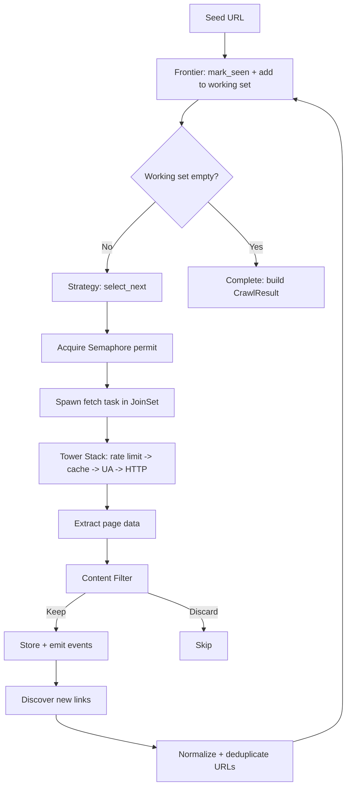

# Crawl Engine

The `CrawlEngine` is the central orchestrator of kreuzcrawl. It composes trait implementations into a crawl pipeline and exposes three primary operations: `scrape` (single page), `crawl` (multi-page traversal), and `map` (site discovery).

## Builder API

`CrawlEngine` is always constructed through `CrawlEngineBuilder`:

```rust
use kreuzcrawl::{CrawlEngine, CrawlConfig};
use kreuzcrawl::defaults::{DfsStrategy, Bm25Filter, DiskCache};

let config = CrawlConfig {
    max_depth: Some(3),
    max_pages: Some(100),
    max_concurrent: Some(5),
    respect_robots_txt: true,
    ..Default::default()
};

let engine = CrawlEngine::builder()
    .config(config)
    .strategy(DfsStrategy)
    .content_filter(Bm25Filter::new("rust programming", 0.3))
    .cache(DiskCache::default_location()?)
    .build()?;
```

Every builder method accepts any type that implements the corresponding trait. Unset fields default to:

| Field | Default |
|-------|---------|
| `config` | `CrawlConfig::default()` |
| `frontier` | `InMemoryFrontier::new()` |
| `rate_limiter` | `PerDomainThrottle::new(200ms)` |
| `store` | `NoopStore` |
| `event_emitter` | `NoopEmitter` |
| `strategy` | `BfsStrategy` |
| `content_filter` | `NoopFilter` |
| `cache` | `NoopCache` |

The `build()` method validates the configuration and returns `Result<CrawlEngine, CrawlError>`.

## Operations

### `scrape(url)` -- Single Page

Routes a single URL through the Tower service stack, then runs the extraction pipeline on the response. Returns a `ScrapeResult` containing HTML, metadata, links, images, feeds, JSON-LD, markdown, and more.

### `crawl(url)` / `crawl_stream(url)` -- Multi-Page Traversal

Performs a full crawl starting from a seed URL. `crawl` returns a `CrawlResult` when complete; `crawl_stream` yields `CrawlEvent` items incrementally through a channel.

### `map(url)` -- Site Discovery

Discovers all pages on a website by following links and sitemaps, returning a `MapResult`.

## Traversal Strategies

The `CrawlStrategy` trait controls which URL to crawl next. Four built-in strategies are provided:

### BfsStrategy (default)

Breadth-first search. Always selects the first (oldest) candidate from the working set, ensuring level-by-level exploration.

```rust
fn select_next(&self, candidates: &[FrontierEntry]) -> Option<usize> {
    if candidates.is_empty() { None } else { Some(0) }
}
```

### DfsStrategy

Depth-first search. Always selects the last (newest) candidate, giving LIFO / stack behavior that dives deep before backtracking.

### BestFirstStrategy

Selects the candidate with the highest `priority` value. The default scoring function uses inverse depth (`1.0 / (depth + 1.0)`), but consumers can override `score_url` for custom prioritization.

### AdaptiveStrategy

An intelligent strategy that monitors content saturation and stops crawling when diminishing returns are detected. It tracks the rate of new unique terms discovered per page within a sliding window. When the ratio of new terms to total terms drops below a configurable `saturation_threshold`, the strategy signals the engine to stop.

```rust
let strategy = AdaptiveStrategy::new(
    10,   // window_size: number of recent pages to consider
    0.05, // saturation_threshold: stop below this ratio
);
```

The adaptive strategy calls `on_page_processed` after each page to update its term frequency model.

## Concurrent Fetching

The crawl loop uses Tokio's `JoinSet` and `Semaphore` for bounded concurrent fetching:

- **`JoinSet`** manages a dynamic set of in-flight fetch tasks. Each task runs through the Tower service stack independently.
- **`Semaphore`** enforces the concurrency limit (`max_concurrent`, default 10). A permit is acquired before spawning each fetch task.
- **Working set**: The engine maintains an in-memory working set of candidate URLs. The `CrawlStrategy::select_next` method picks URLs from this set, giving strategies random access to all candidates for intelligent selection.



## URL Deduplication and Normalization

Before adding a discovered URL to the working set, the engine applies:

1. **Fragment stripping** -- `#section` anchors are removed.
2. **URL normalization** -- scheme lowercasing, host normalization, path canonicalization, default port removal, and query parameter sorting.
3. **Dedup check** -- the `Frontier::is_seen` / `mark_seen` methods prevent re-visiting URLs. The default `InMemoryFrontier` uses an `AHashSet` for O(1) lookups.

The normalization is applied through `normalize_url_for_dedup`, producing a canonical form that catches duplicate URLs with different surface representations (e.g., trailing slashes, percent encoding differences).

## Crawl State

The crawl loop maintains a `CrawlState` struct that accumulates results during traversal:

- `pages: Vec<CrawlPageResult>` -- all successfully crawled pages
- `normalized_urls: Vec<String>` -- all URLs visited (in order)
- `redirect_count` -- total redirect hops observed
- `all_cookies: Vec<CookieInfo>` -- cookies collected across pages
- `pages_failed` / `urls_discovered` / `urls_filtered` -- statistics

The `CrawlStrategy::should_continue` method is consulted after each page, allowing strategies like `AdaptiveStrategy` to terminate the crawl early when content saturation is detected.
