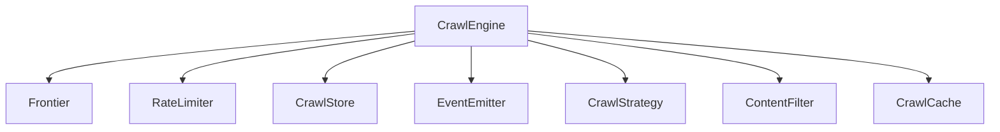

# Plugin System

Kreuzcrawl's behavior is fully customizable through seven traits defined in `crates/kreuzcrawl/src/traits.rs`. Each trait represents a distinct extension point, and default implementations are provided for all of them. Custom implementations are registered through the `CrawlEngineBuilder`.

## Trait Overview



## All 7 Traits

### 1. Frontier

URL queue with deduplication. Controls which URLs are pending and prevents re-visiting.

```rust
#[async_trait]
pub trait Frontier: Send + Sync {
    async fn push(&self, entry: FrontierEntry) -> Result<(), CrawlError>;
    async fn pop(&self) -> Result<Option<FrontierEntry>, CrawlError>;
    async fn pop_batch(&self, n: usize) -> Result<Vec<FrontierEntry>, CrawlError>;
    async fn len(&self) -> Result<usize, CrawlError>;
    async fn is_empty(&self) -> Result<bool, CrawlError>;
    async fn is_seen(&self, url: &str) -> Result<bool, CrawlError>;
    async fn mark_seen(&self, url: &str) -> Result<(), CrawlError>;
}
```

**`FrontierEntry`** carries the URL, depth, and priority score:

```rust
pub struct FrontierEntry {
    pub url: String,
    pub depth: usize,
    pub priority: f64,
}
```

**Default:** `InMemoryFrontier` -- a `VecDeque<FrontierEntry>` for FIFO ordering and `AHashSet<String>` for O(1) dedup lookups. Both are wrapped in `Mutex` for thread safety.

**When to customize:** distributed crawling (Redis-backed queue), persistent frontier (SQLite), or priority queues with custom ordering.

### 2. RateLimiter

Per-domain request throttling with adaptive backoff.

```rust
#[async_trait]
pub trait RateLimiter: Send + Sync {
    async fn acquire(&self, domain: &str) -> Result<(), CrawlError>;
    async fn record_response(&self, domain: &str, status: u16) -> Result<(), CrawlError>;
    async fn set_crawl_delay(&self, domain: &str, delay: Duration) -> Result<(), CrawlError>;
}
```

**Default:** `PerDomainThrottle` -- enforces a minimum 200ms delay between requests to the same domain. Doubles the delay on HTTP 429 responses (up to 60s max), decays the delay after 5 consecutive successes, and respects robots.txt crawl-delay.

**Also available:** `NoopRateLimiter` -- allows all requests through immediately with no throttling.

**When to customize:** shared rate limiting across distributed crawlers, token bucket algorithms, or external rate limit services.

### 3. CrawlStore

Persistence for crawl results, errors, and completion events.

```rust
#[async_trait]
pub trait CrawlStore: Send + Sync {
    async fn store_page(&self, url: &str, result: &ScrapeResult) -> Result<(), CrawlError>;
    async fn store_crawl_page(&self, url: &str, result: &CrawlPageResult) -> Result<(), CrawlError>;
    async fn store_error(&self, url: &str, error: &CrawlError) -> Result<(), CrawlError>;
    async fn on_complete(&self, stats: &CrawlStats) -> Result<(), CrawlError>;
}
```

**Default:** `NoopStore` -- discards all data. Crawl results are only available through the returned `CrawlResult`.

**When to customize:** database persistence (PostgreSQL, SQLite), file-based storage, streaming to S3, or WARC archive output.

### 4. EventEmitter

Lifecycle event hooks for monitoring and progress tracking.

```rust
#[async_trait]
pub trait EventEmitter: Send + Sync {
    async fn on_page(&self, event: &PageEvent);
    async fn on_error(&self, event: &ErrorEvent);
    async fn on_complete(&self, event: &CompleteEvent);
    async fn on_discovered(&self, url: &str, depth: usize);
}
```

Event types:

| Event | Fields |
|-------|--------|
| `PageEvent` | `url`, `status_code`, `depth` |
| `ErrorEvent` | `url`, `error` |
| `CompleteEvent` | `pages_crawled` |

**Default:** `NoopEmitter` -- silently discards all events.

**When to customize:** progress bars, logging, metrics collection, webhook notifications, or real-time dashboards.

### 5. CrawlStrategy

Synchronous URL selection and scoring. This is the only non-async trait -- implementations must be `Send + Sync` but do not use `async_trait`.

```rust
pub trait CrawlStrategy: Send + Sync {
    fn select_next(&self, candidates: &[FrontierEntry]) -> Option<usize>;
    fn score_url(&self, url: &str, depth: usize) -> f64;
    fn should_continue(&self, stats: &CrawlStats) -> bool;
    fn on_page_processed(&self, page: &CrawlPageResult);
}
```

- **`select_next`** -- picks the index of the next URL to crawl from the candidate set. Return `None` to stop.
- **`score_url`** -- assigns a priority score to a discovered URL. Default: `1.0 / (depth + 1.0)`.
- **`should_continue`** -- consulted after each page. Return `false` to terminate the crawl.
- **`on_page_processed`** -- callback for strategies that adapt based on crawled content.

**Built-in strategies:**

| Strategy | Selection Behavior |
|----------|-------------------|
| `BfsStrategy` | First candidate (FIFO / breadth-first) |
| `DfsStrategy` | Last candidate (LIFO / depth-first) |
| `BestFirstStrategy` | Highest `priority` value |
| `AdaptiveStrategy` | BFS with term-saturation early stopping |

**When to customize:** topic-focused crawling, link-graph-aware selection, or ML-based URL scoring.

### 6. ContentFilter

Post-extraction content filter that decides whether to keep or discard a page.

```rust
#[async_trait]
pub trait ContentFilter: Send + Sync {
    async fn filter(&self, page: CrawlPageResult) -> Result<Option<CrawlPageResult>, CrawlError>;
}
```

Return `Some(page)` to keep the page, `None` to discard it.

**Default:** `NoopFilter` -- passes everything through.

**Also available:** `Bm25Filter` -- scores pages against a search query using BM25 TF-saturation. Pages scoring below a configurable threshold are discarded:

```rust
let filter = Bm25Filter::new("rust async programming", 0.3);
```

**When to customize:** content deduplication, language filtering, quality scoring, or domain-specific relevance checks.

### 7. CrawlCache

HTTP response cache for avoiding re-fetching unchanged pages. Integrated into the Tower stack via `CrawlCacheLayer`.

```rust
#[async_trait]
pub trait CrawlCache: Send + Sync {
    async fn get(&self, key: &str) -> Result<Option<CachedPage>, CrawlError>;
    async fn set(&self, key: &str, page: &CachedPage) -> Result<(), CrawlError>;
    async fn has(&self, key: &str) -> Result<bool, CrawlError>;
}
```

**Default:** `NoopCache` -- always returns `None` (no caching).

**Also available:** `DiskCache` -- filesystem-backed cache with blake3 key hashing, TTL-based expiry, LRU eviction, and atomic writes:

```rust
// Custom configuration
let cache = DiskCache::new("./cache", 3600, 10000)?; // 1h TTL, 10k max entries

// Or use defaults (.kreuzcrawl/cache/, 1h TTL, 10k entries)
let cache = DiskCache::default_location()?;
```

**When to customize:** Redis/Memcached caching, database-backed cache, or conditional caching based on content type.

## Implementing a Custom Plugin

To implement a custom plugin, define a struct and implement the corresponding trait:

```rust
use async_trait::async_trait;
use kreuzcrawl::traits::{CrawlStore, CrawlStats};
use kreuzcrawl::types::{CrawlPageResult, ScrapeResult};
use kreuzcrawl::error::CrawlError;

pub struct PostgresStore {
    pool: sqlx::PgPool,
}

#[async_trait]
impl CrawlStore for PostgresStore {
    async fn store_page(&self, url: &str, result: &ScrapeResult) -> Result<(), CrawlError> {
        sqlx::query("INSERT INTO pages (url, title, html) VALUES ($1, $2, $3)")
            .bind(url)
            .bind(&result.metadata.title)
            .bind(&result.html)
            .execute(&self.pool)
            .await
            .map_err(|e| CrawlError::Other(e.to_string()))?;
        Ok(())
    }

    async fn store_crawl_page(
        &self, url: &str, result: &CrawlPageResult,
    ) -> Result<(), CrawlError> {
        // persist crawl page result
        Ok(())
    }

    async fn store_error(
        &self, url: &str, error: &CrawlError,
    ) -> Result<(), CrawlError> {
        // log or persist error
        Ok(())
    }

    async fn on_complete(&self, stats: &CrawlStats) -> Result<(), CrawlError> {
        // finalize crawl session
        Ok(())
    }
}
```

## Registration via Builder

All plugins are registered through the builder:

```rust
let engine = CrawlEngine::builder()
    .config(config)
    .frontier(my_redis_frontier)
    .rate_limiter(my_distributed_limiter)
    .store(PostgresStore::new(pool))
    .event_emitter(WebhookEmitter::new(webhook_url))
    .strategy(AdaptiveStrategy::new(10, 0.05))
    .content_filter(Bm25Filter::new("search query", 0.3))
    .cache(DiskCache::default_location()?)
    .build()?;
```

Each builder method accepts `impl Trait + 'static`, so any type implementing the trait can be passed directly. The builder wraps it in `Arc` internally.
