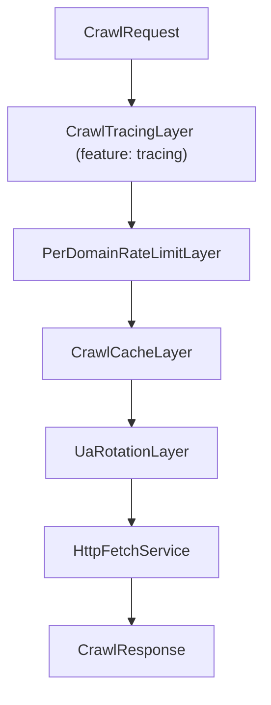

# Tower Middleware

Kreuzcrawl's HTTP pipeline is built on the [Tower](https://docs.rs/tower) `Service` abstraction. Each middleware layer wraps the next, forming a composable stack that processes `CrawlRequest` values and produces `CrawlResponse` results.

## Service Contract

All layers operate on the same request/response types:

```rust
pub struct CrawlRequest {
    pub url: String,
    pub headers: HashMap<String, String>,
}

pub struct CrawlResponse {
    pub status: u16,
    pub content_type: String,
    pub body: String,
    pub body_bytes: Vec<u8>,
    pub headers: HashMap<String, Vec<String>>,
}
```

Every service in the stack implements `Service<CrawlRequest, Response = CrawlResponse, Error = CrawlError>`.

## Layer Composition Order

The stack is assembled in `CrawlEngine::build_service` using Tower's `ServiceBuilder`. Layers are listed outermost to innermost -- a request passes through them top-to-bottom, and the response bubbles back up:



> `CrawlTracingLayer` is only included when the `tracing` feature is enabled. All other layers are always present.

### 1. CrawlTracingLayer (feature: `tracing`)

Wraps each request in a `tracing::info_span!` with OpenTelemetry-compatible fields:

- `otel.kind = "client"`
- `url.full` -- the full request URL
- `server.address` -- the domain extracted from the URL
- `http.request.method = "GET"`
- `http.response.status_code` -- filled after the response arrives
- `http.response.body.size` -- response body length

Emits an `info` event on fetch completion with status code and body size.

### 2. PerDomainRateLimitLayer

Delegates to the engine's `RateLimiter` trait implementation. Before forwarding a request, it calls `rate_limiter.acquire(domain)` which blocks until the domain's rate limit window permits another request. After receiving a response, it calls `rate_limiter.record_response(domain, status)` to feed adaptive backoff logic.

The default `PerDomainThrottle` implementation:

- Maintains per-domain state: last request time, crawl delay, and consecutive success count.
- Enforces a configurable minimum delay between requests to the same domain (default: 200ms).
- Respects `robots.txt` crawl-delay via `set_crawl_delay`.
- **Adaptive backoff on 429**: doubles the delay on rate-limit responses, up to a 60-second maximum.
- **Decay on success**: after 5 consecutive successful responses, halves the backoff delay (floored at the robots.txt delay or the default).

```rust
// Domain state tracked per host
struct DomainState {
    last_request: Instant,
    crawl_delay: Option<Duration>,   // adaptive backoff
    robots_delay: Option<Duration>,  // floor from robots.txt
    consecutive_success: u32,
}
```

### 3. CrawlCacheLayer

Intercepts requests and checks the `CrawlCache` trait for cached responses before forwarding to the inner service.

**Cache hit**: returns the cached `CrawlResponse` immediately, reconstructing headers from stored `etag` and `last_modified` values. No HTTP request is made.

**Cache miss**: forwards to the inner service, then stores successful responses (status 200-299) in the cache as `CachedPage` entries:

```rust
pub struct CachedPage {
    pub url: String,
    pub status_code: u16,
    pub content_type: String,
    pub body: String,
    pub etag: Option<String>,
    pub last_modified: Option<String>,
    pub cached_at: u64,  // Unix timestamp
}
```

The default `NoopCache` always misses, effectively disabling caching. For production use, `DiskCache` provides filesystem-backed caching with:

- **blake3 key hashing** for deterministic, collision-resistant filenames.
- **TTL-based expiry** (default: 1 hour).
- **LRU eviction** when the entry count exceeds the configured maximum (default: 10,000).
- **Atomic writes** via temp file + rename.

### 4. UaRotationLayer

Injects a rotating `User-Agent` header into each request using an `AtomicUsize` counter:

```rust
let idx = self.index.fetch_add(1, Ordering::Relaxed) % self.user_agents.len();
req.headers.insert("user-agent", self.user_agents[idx].clone());
```

The rotation counter is shared across all service rebuilds (the `UaRotationLayer` is stored on `CrawlEngine` and cloned into each stack build). If the user-agent list is empty, no header is injected and the `HttpFetchService` falls back to the default `kreuzcrawl/{version}` user-agent.

### 5. HttpFetchService

The innermost service that performs the actual HTTP request using `reqwest::Client`. Responsibilities:

- **User-Agent fallback**: if no UA header was set by the rotation layer, uses `config.user_agent` or the default `kreuzcrawl/{version}` string.
- **Authentication**: supports `Basic`, `Bearer`, and custom `Header` auth via `AuthConfig`.
- **Custom headers**: merges `config.custom_headers` and request-level headers from middleware.
- **Error classification**: maps HTTP status codes to typed `CrawlError` variants (`401` -> `Unauthorized`, `403` -> `Forbidden`/`WafBlocked`, `404` -> `NotFound`, `429` -> `RateLimited`, `5xx` -> `ServerError`/`BadGateway`).
- **WAF detection**: on 403 responses, inspects the `Server` header and body for WAF signatures (Cloudflare, Akamai, etc.).
- **Content-length validation**: detects truncated responses by comparing `Content-Length` header to actual body size.
- **Retry with exponential backoff**: retries on server errors, rate limits, and configurable status codes. Delay starts at 100ms and doubles per attempt (`100ms * 2^attempt`).

## Extending the Stack

Custom middleware can be added by implementing Tower's `Layer` and `Service` traits for the `CrawlRequest`/`CrawlResponse` types. However, the current stack is assembled internally by `CrawlEngine::build_service` and is not directly extensible from the public API. Customization is achieved through the trait system (custom `RateLimiter`, `CrawlCache`, etc.) rather than adding new Tower layers.
